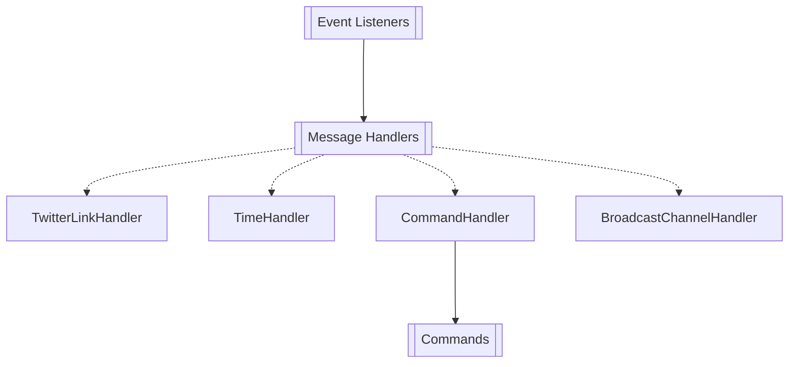

### KatBot Usage and Architecture

Command flow

KatBot listens to all messages in all allowed channels. Right now there are **two** ways to interact with KatBot:
1. via guild messages _(GuildMessageListener)_
2. via button interactions _(ButtonInteractionListener)_

Message is then passed to the **Message Handlers** which are responsible for handling the message and executing the appropriate action. Current message handlers:
1. **TwitterLinkHandler** - Handles Twitter links and remakes them into embeds.
2. **TimeHandler** - Detects if message contains time and proposes to the author to convert it to a timezone.
3. **CommandHandler** - Handles commands that start with `kat` and executes the appropriate action.
4. ~~**BroadcastChannelHandler**~~ (deprecated) - Handles messages that are sent to the broadcast channel and forwards them to the appropriate channel.

Graph made in Mermaid:

Useful locations

- Listener implementations: `src/main/java/com/katbot/eventListeners`
- Message handlers: `src/main/java/com/katbot/messageHandlers`
- Commands: `src/main/java/com/katbot/messageHandlers/commandHandler/commands`
