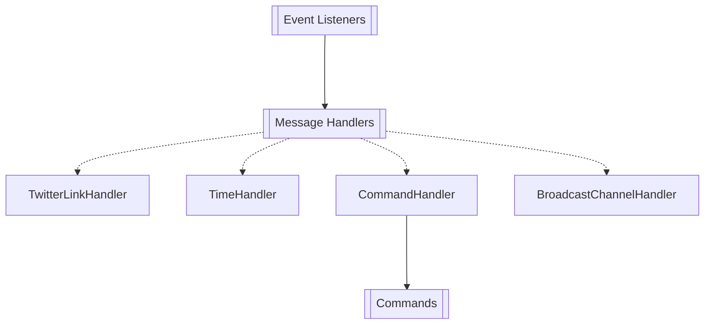

### KatBot 3.0 Deployment Guide

*(In case I forget :))*

### Local Build and Docker Image Creation

1. **Build the JAR file**  
   First, ensure that the application is packaged as a JAR file using Maven:

   ```bash
   mvn clean package
   ```

2. **Build the Docker Image**  
   Once the JAR is ready, build the Docker image using the following command:

   ```bash
   docker build -t kat-bot:1.0 .
   ```

3. **Export the Docker Image as a `.tar` file**  
   To export the Docker image to a `.tar` file for deployment, run:

   ```bash
   docker save -o kat-bot-1.0.tar kat-bot:1.0
   ```

   This will create a `kat-bot-1.0.tar` file that can be transferred to the remote server.

### Remote Deployment

The application is deployed on a VPS as a Docker container using the exported `.tar` file.

1. **Transfer the Tarball**  
   Use an SCP client like MobaXterm, WinSCP, or a GUI to transfer the `kat-bot-1.0.tar` file to your VPS.

2. **Stop the previously running docker image**
   First, stop the running docker container by running this command:
   ```bash
   docker stop <container_id/container_name>
   ```
 
3. **Load the Docker Image**  
   Once the tarball is on the VPS, log in to the server via SSH and run the following command to load the Docker image:

   ```bash
   docker load -i kat-bot-1.0.tar
   ```

4. **Run the Docker Container**  
   After loading the image, you can run the container. Make sure you have an `.env` file with the required environment variables in the same directory.
   For the container to connect to the database it has to be running in the same docker compose network. docker-compose.yaml should be already present on the VPS.

   For a simple restart with the new image, take down the old image as usual and use this command (just make sure that the .yaml file is in the same directory as you)

   ```bash
   docker compose up -d
   ```
   - d - stands for detached mode - it means that Docker Compose will run your containers in the background

And boom! You're done!

If you want to check the console of the currently running container you can use:
   ```bash
   docker logs -f <image_name>
   ```
   
   Where <image_name> is the generated name of the image.
   -f - follow flag

---

### Additional Notes

- Ensure that Docker is installed and running on both your local machine and the VPS.
- Adjust any port mappings or environment variables as needed.
- The `docker run` command can be modified to fit specific deployment needs, such as exposing different ports or passing additional parameters.

### Command flow

KatBot listens to all messages in all allowed channels. Right now there are **two** ways to interact with KatBot:
1. via guild messages _(GuildMessageListener)_
2. via button interactions _(ButtonInteractionListener)_

Message is then passed to the **Message Handlers** which are responsible for handling the message and executing the appropriate action. Right now there are **four** message handlers:
1. **TwitterLinkHandler** - Handles Twitter links and remakes them into embeds.
2. **TimeHandler** - Detects if message contains time and proposes to the author to convert it to a timezone.
3. **CommandHandler** - Handles commands that start with `kat` and executes the appropriate action.
4. ~~**BroadcastChannelHandler**~~ (deprecated) - Handles messages that are sent to the broadcast channel and forwards them to the appropriate channel.

Graph made in Mermaid:

